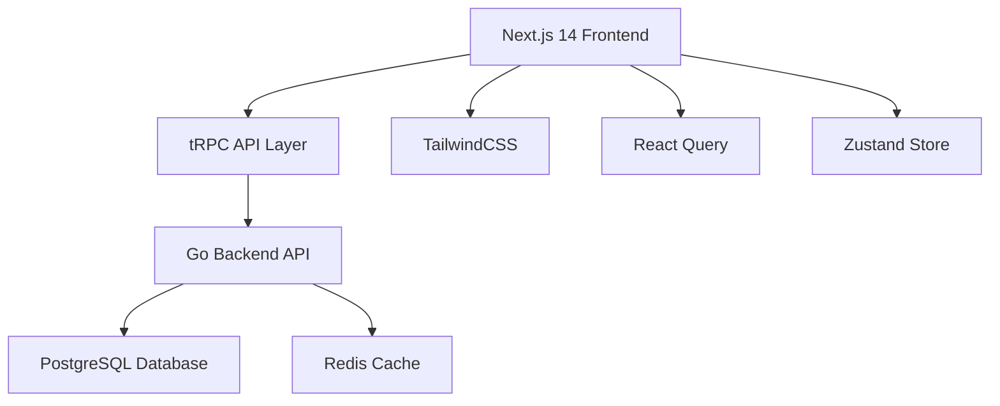

# 👥 VIPORT ENTERPRISE TEAM ONBOARDING GUIDE

## 🎯 **WELCOME TO VIPORT ENTERPRISE**
Comprehensive guide for onboarding new team members to the migrated Next.js enterprise platform.

---

## 🚀 **QUICK START (15 minutes)**

### **Prerequisites**
- Node.js >= 18.17.0
- npm >= 9.0.0
- Docker & Docker Compose
- Git
- VS Code (recommended)

### **1. Environment Setup**
```bash
# Clone repository
git clone <repository-url>
cd viport

# Install dependencies (may need legacy peer deps due to tRPC version)
npm install --legacy-peer-deps

# Copy environment variables
cp .env.example .env.local

# Start database services
docker-compose -f docker-compose.dev.yml up -d

# Start Go backend (Terminal 1)
cd backend && go run cmd/api/main.go

# Start Next.js frontend (Terminal 2)
npm run dev
```

### **2. Verify Setup**
- ✅ Frontend: http://localhost:3000
- ✅ Backend API: http://localhost:8080/api/health
- ✅ Database: PostgreSQL on localhost:5432
- ✅ Redis: localhost:6379

---

## 🏗️ **ARCHITECTURE OVERVIEW**

### **Technology Stack**


### **Project Structure**
```
viport/
├── src/                    # Next.js application source
│   ├── app/               # App Router (routing & layouts)
│   │   ├── (auth)/       # Auth route group
│   │   ├── api/          # API routes
│   │   └── layout.tsx    # Root layout
│   ├── components/       # Reusable components
│   │   ├── ui/          # Base UI components (shadcn)
│   │   ├── auth/        # Authentication components
│   │   └── posts/       # Feature components
│   ├── lib/             # Utilities & configurations
│   │   ├── trpc/        # tRPC setup
│   │   └── api/         # API client
│   ├── hooks/           # Custom React hooks
│   ├── providers/       # Context providers
│   └── types/           # TypeScript definitions
├── backend/             # Go API server
│   ├── cmd/api/         # Application entry point
│   ├── internal/        # Private application code
│   │   ├── handlers/    # HTTP handlers
│   │   ├── models/      # Data models
│   │   └── middleware/  # HTTP middleware
│   └── pkg/            # Public packages
└── tests/              # Test suites
```

---

## 💻 **DEVELOPMENT WORKFLOW**

### **Daily Development Commands**
```bash
# Start development environment
npm run dev              # Frontend (port 3000)
make dev-backend        # Backend (port 8080)
make dev-deps           # Databases only

# Quality checks
npm run type-check      # TypeScript validation
npm run lint           # Code linting
npm run format         # Code formatting
npm run test           # Unit tests
npm run e2e            # End-to-end tests

# Build and deploy
npm run build          # Production build
npm run analyze        # Bundle analysis
```

### **Git Workflow**
```bash
# Feature development
git checkout -b feature/new-feature
git add .
git commit -m "feat: add new feature"
git push origin feature/new-feature

# Pre-commit hooks automatically run:
# - ESLint
# - Prettier
# - TypeScript check
# - Test suite
```

### **Code Review Checklist**
- [ ] TypeScript types are properly defined
- [ ] Components follow naming conventions
- [ ] Error handling is implemented
- [ ] Tests are included for new features
- [ ] Performance implications considered
- [ ] Security best practices followed

---

## 🧩 **KEY CONCEPTS & PATTERNS**

### **1. App Router (Next.js 14)**
```typescript
// Route structure
src/app/
├── layout.tsx           # Root layout
├── page.tsx            # Home page
├── (auth)/             # Route group
│   ├── layout.tsx     # Auth layout
│   ├── login/
│   │   └── page.tsx   # /login
│   └── register/
│       └── page.tsx   # /register
└── posts/
    └── [id]/
        └── page.tsx    # /posts/[id]
```

### **2. Server vs Client Components**
```typescript
// Server Component (default)
export default function ServerComponent() {
  // Runs on server, can access database directly
  return <div>Server rendered content</div>
}

// Client Component
'use client'
export default function ClientComponent() {
  // Runs in browser, has access to hooks, events
  const [state, setState] = useState()
  return <div>Interactive content</div>
}
```

### **3. tRPC Integration**
```typescript
// Define API routes
// src/lib/trpc/routers/posts.ts
export const postsRouter = router({
  getAll: publicProcedure
    .query(async () => {
      // Fetch from Go backend
      return fetchPosts()
    }),
  
  create: protectedProcedure
    .input(z.object({ title: z.string() }))
    .mutation(async ({ input }) => {
      return createPost(input)
    }),
})

// Use in components
'use client'
function PostsList() {
  const { data, isLoading } = trpc.posts.getAll.useQuery()
  const createPost = trpc.posts.create.useMutation()
  
  return (
    <div>
      {data?.map(post => <PostCard key={post.id} post={post} />)}
    </div>
  )
}
```

### **4. State Management Patterns**
```typescript
// Global state with Zustand
interface UserStore {
  user: User | null
  setUser: (user: User) => void
  logout: () => void
}

export const useUserStore = create<UserStore>((set) => ({
  user: null,
  setUser: (user) => set({ user }),
  logout: () => set({ user: null }),
}))

// Server state with React Query (via tRPC)
function Profile() {
  const { data: user } = trpc.users.getProfile.useQuery()
  return <div>{user?.name}</div>
}
```

---

## 🎨 **STYLING & UI GUIDELINES**

### **Component Structure**
```typescript
// components/ui/button.tsx
import { cn } from '@/lib/utils'
import { cva, type VariantProps } from 'class-variance-authority'

const buttonVariants = cva(
  "inline-flex items-center justify-center rounded-md font-medium transition-colors",
  {
    variants: {
      variant: {
        default: "bg-primary text-primary-foreground hover:bg-primary/90",
        outline: "border border-input hover:bg-accent",
      },
      size: {
        default: "h-10 px-4 py-2",
        sm: "h-9 rounded-md px-3",
        lg: "h-11 rounded-md px-8",
      },
    },
    defaultVariants: {
      variant: "default",
      size: "default",
    },
  }
)

interface ButtonProps
  extends React.ButtonHTMLAttributes<HTMLButtonElement>,
    VariantProps<typeof buttonVariants> {}

export function Button({ className, variant, size, ...props }: ButtonProps) {
  return (
    <button
      className={cn(buttonVariants({ variant, size, className }))}
      {...props}
    />
  )
}
```

### **Styling Best Practices**
- Use Tailwind classes for styling
- Create reusable components with variants
- Follow shadcn/ui patterns for consistency
- Use CSS variables for theming
- Implement dark mode support

---

## 🧪 **TESTING STRATEGIES**

### **Testing Pyramid**
```typescript
// Unit Tests (Jest + Testing Library)
// src/components/__tests__/Button.test.tsx
import { render, screen } from '@testing-library/react'
import { Button } from '../Button'

test('renders button with text', () => {
  render(<Button>Click me</Button>)
  expect(screen.getByRole('button')).toHaveTextContent('Click me')
})

// Integration Tests (tRPC)
// tests/api/users.test.ts
import { createTRPCMsw } from 'msw-trpc'
import { trpc } from '@/lib/trpc/client'

test('fetches user profile', async () => {
  const result = await trpc.users.getProfile.query()
  expect(result).toMatchObject({ id: 1, name: 'John' })
})

// E2E Tests (Playwright)
// tests/e2e/auth.spec.ts
import { test, expect } from '@playwright/test'

test('user can login', async ({ page }) => {
  await page.goto('/login')
  await page.fill('[name=email]', 'test@example.com')
  await page.fill('[name=password]', 'password')
  await page.click('button[type=submit]')
  await expect(page).toHaveURL('/dashboard')
})
```

### **Testing Commands**
```bash
# Unit tests
npm run test                # Run all tests
npm run test:watch         # Watch mode
npm run test:coverage      # Coverage report

# E2E tests
npm run e2e               # Run Playwright tests
npm run e2e:ui            # Run with UI mode
npm run e2e:debug         # Debug mode
```

---

## 🔐 **SECURITY BEST PRACTICES**

### **Authentication Flow**
```typescript
// src/providers/auth-provider.tsx
'use client'

interface AuthContextType {
  user: User | null
  login: (email: string, password: string) => Promise<void>
  logout: () => void
  isLoading: boolean
}

export function AuthProvider({ children }: { children: React.ReactNode }) {
  const [user, setUser] = useState<User | null>(null)
  
  const login = async (email: string, password: string) => {
    const response = await fetch('/api/auth/login', {
      method: 'POST',
      headers: { 'Content-Type': 'application/json' },
      body: JSON.stringify({ email, password }),
    })
    
    if (response.ok) {
      const { user, accessToken } = await response.json()
      localStorage.setItem('accessToken', accessToken)
      setUser(user)
    }
  }
  
  return (
    <AuthContext.Provider value={{ user, login, logout, isLoading }}>
      {children}
    </AuthContext.Provider>
  )
}
```

### **Route Protection**
```typescript
// src/components/auth/protected-route.tsx
export function ProtectedRoute({ children }: { children: React.ReactNode }) {
  const { user, isLoading } = useAuth()
  
  if (isLoading) return <LoadingSpinner />
  
  if (!user) {
    redirect('/login')
  }
  
  return <>{children}</>
}

// Usage in pages
export default function DashboardPage() {
  return (
    <ProtectedRoute>
      <Dashboard />
    </ProtectedRoute>
  )
}
```

---

## 🐛 **DEBUGGING & TROUBLESHOOTING**

### **Common Issues & Solutions**

#### **1. TypeScript Errors**
```bash
# Clear Next.js cache
rm -rf .next

# Restart TypeScript server in VS Code
Ctrl+Shift+P -> "TypeScript: Restart TS Server"

# Check type definitions
npm run type-check
```

#### **2. Build Failures**
```bash
# Check for missing dependencies
npm install --legacy-peer-deps

# Clear all caches
npm run clean

# Rebuild from scratch
rm -rf node_modules package-lock.json
npm install --legacy-peer-deps
```

#### **3. API Connection Issues**
```bash
# Check backend is running
curl http://localhost:8080/api/health

# Check database connection
docker ps | grep postgres

# Review API proxy configuration
# Check next.config.js rewrites section
```

### **Development Tools**
- **React DevTools**: Browser extension for React debugging
- **TanStack Query DevTools**: Built-in query debugging
- **Next.js Bundle Analyzer**: `npm run analyze`
- **Prisma Studio**: Database GUI (if using Prisma)

---

## 📊 **PERFORMANCE MONITORING**

### **Key Metrics to Track**
- **Core Web Vitals**: LCP, FID, CLS
- **Bundle Size**: Initial load, vendor chunks
- **Build Time**: Development and production builds
- **API Response Time**: Backend performance
- **Error Rate**: Application and API errors

### **Monitoring Tools Setup**
```typescript
// src/lib/monitoring.ts
import { getCLS, getFID, getFCP, getLCP, getTTFB } from 'web-vitals'

export function initMonitoring() {
  const sendToAnalytics = (metric: any) => {
    // Send to your analytics service
    console.log('Web Vital:', metric)
  }

  getCLS(sendToAnalytics)
  getFID(sendToAnalytics)
  getFCP(sendToAnalytics)
  getLCP(sendToAnalytics)
  getTTFB(sendToAnalytics)
}
```

---

## 📚 **LEARNING RESOURCES**

### **Essential Documentation**
- [Next.js App Router](https://nextjs.org/docs/app)
- [tRPC Documentation](https://trpc.io/docs)
- [TailwindCSS](https://tailwindcss.com/docs)
- [React Query](https://tanstack.com/query/latest)
- [TypeScript](https://www.typescriptlang.org/docs)

### **Internal Resources**
- `MIGRATION_VALIDATION_CHECKLIST.md` - Migration verification
- `PERFORMANCE_COMPARISON_REPORT.md` - Performance metrics
- `TROUBLESHOOTING_GUIDE.md` - Common issues and solutions
- `OPTIMIZATION_RECOMMENDATIONS.md` - Performance improvements

### **Code Examples**
```bash
# Find examples in the codebase
grep -r "useQuery" src/           # React Query usage
grep -r "trpc\." src/            # tRPC usage
find src/ -name "*.stories.tsx"  # Storybook examples
```

---

## 🚀 **DEPLOYMENT & CI/CD**

### **Build Pipeline**
```yaml
# .github/workflows/ci.yml
name: CI/CD Pipeline

on: [push, pull_request]

jobs:
  test:
    runs-on: ubuntu-latest
    steps:
      - uses: actions/checkout@v4
      - uses: actions/setup-node@v4
        with:
          node-version: '18'
      
      - name: Install dependencies
        run: npm ci --legacy-peer-deps
      
      - name: Type check
        run: npm run type-check
      
      - name: Lint
        run: npm run lint
      
      - name: Test
        run: npm run test
      
      - name: Build
        run: npm run build
```

### **Docker Deployment**
```dockerfile
# Dockerfile
FROM node:18-alpine AS deps
WORKDIR /app
COPY package*.json ./
RUN npm ci --only=production --legacy-peer-deps

FROM node:18-alpine AS runner
WORKDIR /app
COPY --from=deps /app/node_modules ./node_modules
COPY . .
RUN npm run build

EXPOSE 3000
CMD ["npm", "start"]
```

---

## 🎯 **TEAM STANDARDS**

### **Code Style**
- Use TypeScript for all new code
- Follow ESLint and Prettier configurations
- Write tests for new features
- Use semantic commit messages
- Keep components small and focused

### **PR Guidelines**
1. **Title**: Use conventional commits format
2. **Description**: Explain what and why
3. **Screenshots**: For UI changes
4. **Testing**: Include test instructions
5. **Breaking Changes**: Document any breaking changes

### **Definition of Done**
- [ ] Feature implemented and tested
- [ ] TypeScript types defined
- [ ] Unit tests written and passing
- [ ] E2E tests passing
- [ ] Code reviewed and approved
- [ ] Documentation updated
- [ ] Performance impact assessed

---

## 📞 **GETTING HELP**

### **Team Communication**
- **Slack**: #viport-dev channel
- **Daily Standups**: 9:00 AM EST
- **Code Reviews**: GitHub PR reviews
- **Architecture Discussions**: Weekly tech sync

### **Escalation Path**
1. **Teammate**: Ask a fellow developer
2. **Tech Lead**: For architectural decisions
3. **DevOps**: For deployment issues
4. **Product**: For feature clarification

### **Documentation**
- **Internal Wiki**: Team processes and decisions
- **API Documentation**: Postman collection
- **Design System**: Figma components
- **Architecture Decision Records**: ADRs in docs/

---

## ✅ **ONBOARDING CHECKLIST**

### **Day 1**
- [ ] Development environment setup complete
- [ ] Can run application locally
- [ ] VS Code configured with extensions
- [ ] Git access and SSH keys configured
- [ ] Slack and tool access confirmed

### **Week 1**
- [ ] First PR merged
- [ ] Understanding of project structure
- [ ] Familiar with development workflow
- [ ] Attended team meetings
- [ ] Read all documentation

### **Month 1**
- [ ] Comfortable with codebase
- [ ] Can work independently on features
- [ ] Understand deployment process
- [ ] Contributing to code reviews
- [ ] Mentoring newer team members

## 🎉 **WELCOME TO THE TEAM!**

You're now part of building a world-class enterprise platform. The migration to Next.js has set us up for incredible scalability and performance. Let's build something amazing together!

**Questions? Reach out to the team - we're here to help! 🚀**